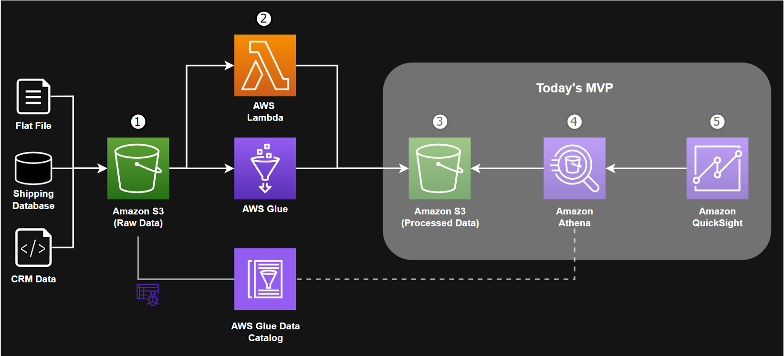

# Sales Insights with Amazon QuickSight

## Problem Statement
Data currently exists in variety of different sources and it take weeks and days to drive any business value from data today.

## Architecture

## Amazon QuickSight
Amazon QuickSight is a very fast, easy-to-use, cloud-powered business analytics service that makes it easy for all employees within an organization to build visualizations, perform ad-hoc analysis, and quickly get business insights from their data, anytime, on any device.
## Amazon Athena
Amazon Athena is an interactive query service that makes it easy to analyze data in Amazon S3 using standard SQL. Athena is serverless, so there is no infrastructure to setup or manage, and you can start analyzing data immediately. You don’t even need to load your data into Athena, it works directly with data stored in S3. 
## AWS Glue
AWS Glue is a serverless data integration service that makes it easy to discover, prepare, and combine data for analytics, machine learning, and application development. AWS Glue provides all the capabilities needed for data integration, so you can start analyzing your data and putting it to use in minutes instead of months.

## Contribution
For contribution, please see [Contribution](./CONTRIBUTING.md).

## License 
Copyright Amazon.com, Inc. or its affiliates. All Rights Reserved.

Permission is hereby granted, free of charge, to any person obtaining a copy of
this software and associated documentation files (the "Software"), to deal in
the Software without restriction, including without limitation the rights to
use, copy, modify, merge, publish, distribute, sublicense, and/or sell copies of
the Software, and to permit persons to whom the Software is furnished to do so.

THE SOFTWARE IS PROVIDED "AS IS", WITHOUT WARRANTY OF ANY KIND, EXPRESS OR
IMPLIED, INCLUDING BUT NOT LIMITED TO THE WARRANTIES OF MERCHANTABILITY, FITNESS
FOR A PARTICULAR PURPOSE AND NONINFRINGEMENT. IN NO EVENT SHALL THE AUTHORS OR
COPYRIGHT HOLDERS BE LIABLE FOR ANY CLAIM, DAMAGES OR OTHER LIABILITY, WHETHER
IN AN ACTION OF CONTRACT, TORT OR OTHERWISE, ARISING FROM, OUT OF OR IN
CONNECTION WITH THE SOFTWARE OR THE USE OR OTHER DEALINGS IN THE SOFTWARE.

